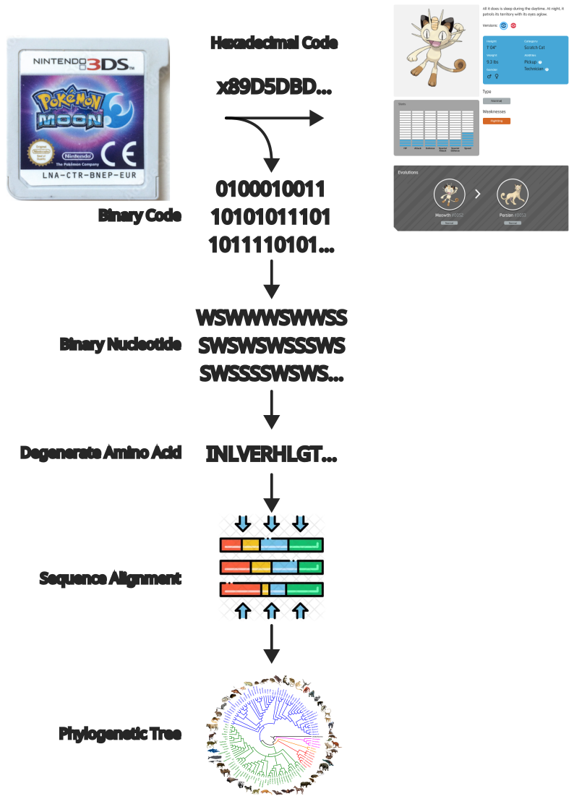

# PyPokeGene - Pokemon Digital Genome Phylogenetic Pipeline

This repository contains a bioinformatics pipeline designed to analyze the "digital genome" of Pokemon from legally purchased Nintendo 3DS ROM cartridges (e.g., Pokemon Moon). The pipeline treats binary code extracted from the ROM as a "digital genome," analogous to nucleotide sequences in biological organisms, and constructs phylogenetic trees to explore evolutionary relationships among Pokemon species.

## Overview

The pipeline transforms hexadecimal code from Pokemon ROMs into binary sequences, interprets these as "digisomes" (digital chromosomes), and processes them through a series of bioinformatics steps to infer phylogenetic relationships. This approach leverages concepts from molecular biology, such as Single Copy Orthologs (SCOs), sequence alignment, and phylogenetic tree construction, adapted to a digital context.

## Workflow

  

1. **ROM Extraction**
   - Extract binary files from a legally purchased Pokemon 3DS ROM (e.g., Pokemon Moon) using 3dsTools and 3dsKit.
   - Convert hexadecimal code (e.g., x89D5DB...) into binary sequences (e.g., 010001001...).

2. **Binary Nucleotide Mapping**
   - Map binary sequences to a custom "binary nucleotide" representation (e.g., WSW...) to mimic genetic sequences.

3. **Degenerate Amino Acid Translation**
   - Translate binary nucleotide sequences into degenerate amino acid sequences (e.g., INLVERHGT...) using a custom codon table.

4. **Sequence Alignment**
   - Align generated amino acid sequences using MAFFT.
   - Trim alignments with TrimAl to remove poorly aligned regions.

5. **Phylogenetic Tree Inference**
   - Infer gene trees for individual SCOs using RAXML.
   - Construct a phylogenomic tree using a concatenated matrix of 100 SCOs in IQ-TREE with 1000 ultrafast bootstraps, gene concordance factors (gCF), and site concordance factors (sCF) for support.
   - Randomly sample SCOs until 100 trees achieve an average bootstrap percentage of at least 80%.

## Requirements

- Python 3.x
- **Dependencies:**
  - biopython for sequence manipulation
  - mafft (via command line or Python wrapper)
  - trimal (via command line or Python wrapper)
  - raxml (via command line or Python wrapper)
  - iqtree (via command line or Python wrapper)
  - 3dstools and 3dsKit for ROM extraction

## Installation

1. Clone the repository:
   git clone https://github.com/yourusername/pokemon-digital-genome.git
   cd pokemon-digital-genome

2. Install Python dependencies:
   pip install biopython

3. Install bioinformatics tools:
   - Install MAFFT, TrimAl, RAXML, and IQ-TREE via your package manager or from their official websites.
   - Install 3dsTools and 3dsKit following their documentation for ROM extraction.

## Usage

1. **Extract Binary Data**
   - Use 3dsTools and 3dsKit to extract binary files from the ROM:
   3dstools extract -i pokemon_moon.3ds -o binary_output
   3dsKit decode -i binary_output/pokemon_entry.bin -o decoded.bin

2. **Run the Pipeline**
   - Execute the main script with a configuration file specifying input paths and parameters:
   python pipeline.py --config config.yaml

   - Example config.yaml:
   input_dir: ./binary_output
   output_dir: ./results
   scos: 100
   bootstraps: 1000
   min_bootstrap: 80

3. **Output**
   - Aligned sequences: ./results/alignments/
   - Trimmed alignments: ./results/trimmed/
   - Gene trees: ./results/gene_trees/
   - Phylogenomic tree: ./results/phylogenomic_tree.treefile

## Notes

- Ensure legal ownership of the Pokemon ROM cartridge.
- The pipeline assumes custom mappings for binary-to-nucleotide and nucleotide-to-amino-acid translations, defined in the script or configuration.
- Adjust parameters (e.g., number of SCOs, bootstraps) based on computational resources and dataset size.

## Contributing

Contributions are welcome! Please fork the repository and submit pull requests for enhancements or bug fixes.

## License

This project is licensed under a custom MIT License with Attribution Requirement. You are free to use, copy, modify, and distribute the code, provided you include attribution to the author, [Your Name], and a reference to this repository. Failure to comply may result in a takedown request or demand for proper referencing. See [LICENSE.txt](LICENSE.txt) for details.
